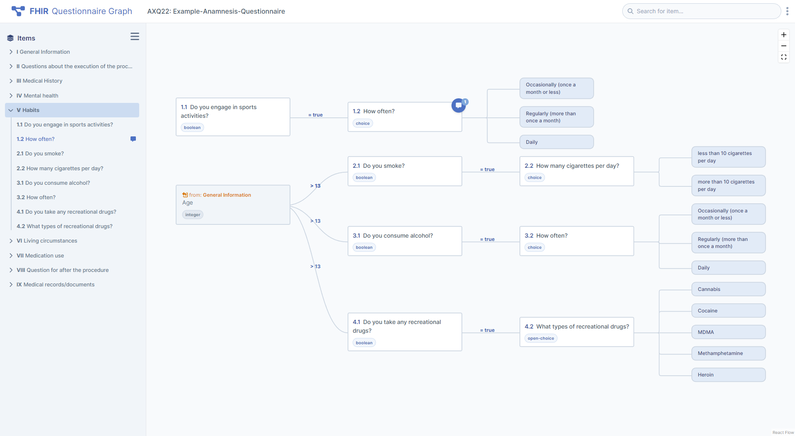

# Fhir Questionnaire Graph
A simple prototype of a  web application for exploring and editorially discussing a Fhir-Questionnaire as a graph. Designed for questionnaires that have a large number of questions and many complex EnableWhen properties.

[Live Demo](https://fhir-questionnaire-graph.vercel.app/)

## Getting Started

### Prerequisites:

- node.js installed (https://nodejs.org/en/)
- dependencies installed (`npm install`)

`npm run dev` - to start development server  
`npm run build` - to build for production
